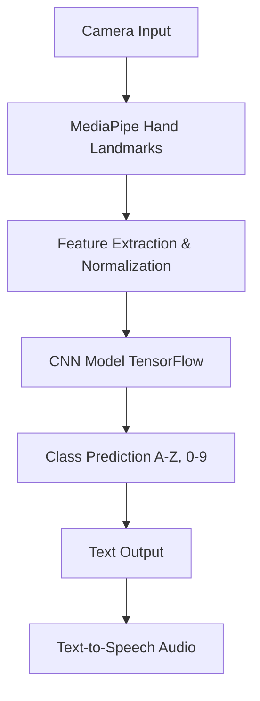

# SIGNX: AI Indian Sign Language Translator

## Overview
SIGNX is an advanced AI-powered platform designed to translate Indian Sign Language (ISL) into text and speech in real-time. By leveraging computer vision and deep learning, SIGNX aims to bridge the communication gap between the Deaf and hard-of-hearing community and the broader society in India.

## Problem Statement
Over 18 million people in India are Deaf or hard of hearing, and Indian Sign Language (ISL) is their primary mode of communication. However, the vast majority of the hearing population does not understand ISL, creating significant barriers in education, healthcare, employment, and daily social interactions.

## Solution
SIGNX utilizes computer vision (MediaPipe) and deep learning (TensorFlow/Keras CNN) to recognize ISL gestures in real-time via a standard webcam. It translates these gestures into readable text and synthesized speech, facilitating seamless two-way communication.

## Features
- **Real-time ISL Recognition**: Translates ISL alphabet (A-Z) and digits (0-9) instantly.
- **Computer Vision Pipeline**: Uses MediaPipe for robust hand landmark extraction.
- **Deep Learning Model**: Custom-trained CNN for high-accuracy gesture classification.
- **Text-to-Speech (TTS)**: Converts translated signs into spoken audio.
- **AI Chatbot Assistant**: Powered by Gemini API for contextual assistance.
- **User Authentication & History**: Secure login, translation history, and user preferences.

## Architecture


## Technology Stack
- **Frontend**: React, Vite, Tailwind CSS
- **Backend**: FastAPI (Python 3.11)
- **Machine Learning**: TensorFlow/Keras, MediaPipe, OpenCV
- **Database**: PostgreSQL
- **AI Integration**: Google Gemini API
- **Infrastructure**: Docker, Docker Compose
- **CI/CD**: GitHub Actions

## Project Structure
```
SIGNX/
├── backend/            # FastAPI backend application
├── frontend/           # React frontend application
├── model/              # ML model resources and weights
├── database/           # SQL schemas and seed data
├── docs/               # Detailed project documentation
├── tests/              # Automated tests (Pytest, etc.)
├── .github/workflows/  # CI/CD pipelines
├── docker-compose.yml  # Docker infrastructure definition
└── README.md           # Project overview and setup
```

## Installation & Setup

### Prerequisites
- Docker and Docker Compose installed
- Python 3.11+
- Node.js 18+

### Environment Setup
1. Clone the repository.
2. Copy `.env.example` to `.env`:
   ```bash
   cp .env.example .env
   ```
3. Update `.env` with your actual secrets, particularly the `GEMINI_API_KEY`.

### Model Setup
The trained `.h5` model is not included in this repository due to size constraints.
1. Download `signx_model.h5` from the provided Google Drive link.
2. Place the file in `model/weights/signx_model.h5`.

### Running with Docker
```bash
docker-compose up --build
```
This will start:
- Frontend on `http://localhost:5173`
- Backend on `http://localhost:8000`
- PostgreSQL on port `5432`

## Documentation Reference
- [Architecture](docs/ARCHITECTURE.md)
- [API Documentation](docs/API.md)
- [Model Details](docs/MODEL.md)
- [ISL Resources](docs/ISL.md)
- [Deployment Guide](docs/DEPLOYMENT.md)
- [Contributing](docs/CONTRIBUTING.md)

## Future Scope
- Expand vocabulary to include dynamic word-level gestures.
- Support multi-lingual text and speech output (Hindi, regional languages).
- Deploy as a mobile application for greater accessibility.

## Contributors
- AI/ML Team
- Backend Team
- Frontend Team
