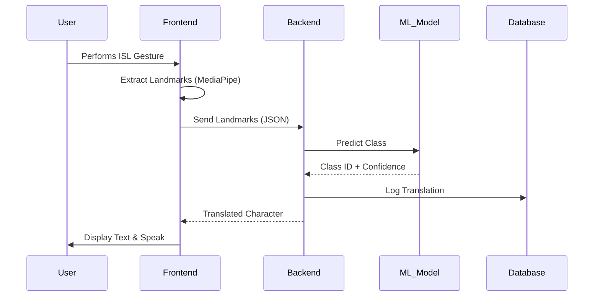

# System Architecture

## Overview
SIGNX follows a modern client-server architecture with a clear separation of concerns.

## Components
1. **Frontend**: React SPA handling video capture, UI, and TTS.
2. **Backend**: FastAPI serving the REST API and managing WebSocket connections for real-time translation (optional future scope).
3. **ML Inference Engine**: Embedded within the backend, loads the `.h5` model to process frame landmarks sent from the frontend or backend.
4. **Database**: PostgreSQL storing user data and translation logs.
5. **LLM Integration**: Google Gemini API for the chatbot assistant.

## Data Flow

## Technology Decisions
- **FastAPI**: Chosen for its high performance, native async support, and auto-generated OpenAPI docs.
- **MediaPipe**: Provides lightweight, accurate, and in-browser capable hand tracking.
- **TensorFlow**: Standard robust framework for CNNs.
